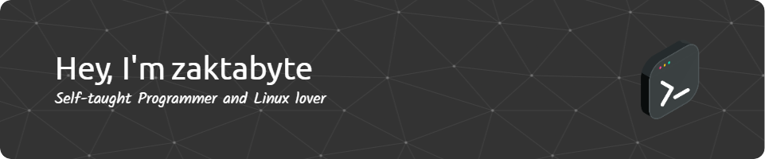

---

### 🧠 About Me

Hi! I'm a tech enthusiast and hobbyist programmer from Poland.  
I wrote my first lines of code at the age of 9 and have been hooked ever since.  
I enjoy building things from scratch, automating tasks, and diving into the world of cyber-security and Linux.

---

### 🛠️ Languages & Tools

#### 💬 Programming Languages

  
  
  
  
  
  
  

#### 🧰 Environments, Frameworks & Tools

  
  
  
  
  
  
  
  
  
  
  
  
  
  
  
  

---

### 🧾 Mentions

* https://x.com/nixcraft/status/1419969356243476483
* https://rutube.ru/video/6c6d483aa7006bef6770933a69300218/
* https://www.zscaler.com/blogs/security-research/threat-actors-distribute-malicious-vpn-apps-masquerading-popular-vendors
* https://codeby.net/threads/userrecon-poisk-pol-zovatelya-cherez-75-sotsial-nykh-setei.64923/
* https://www.blast.hk/threads/208066/
* https://securityboulevard.com/2021/05/threat-actors-distribute-malicious-vpn-apps-masquerading-as-popular-vendors/
* https://www.cyberforum.ru/viruses/thread3150560.html
* https://appspyfree.com/facebook-hack/

